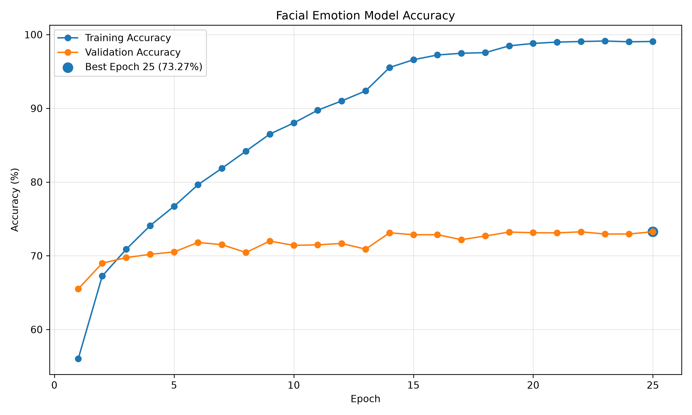
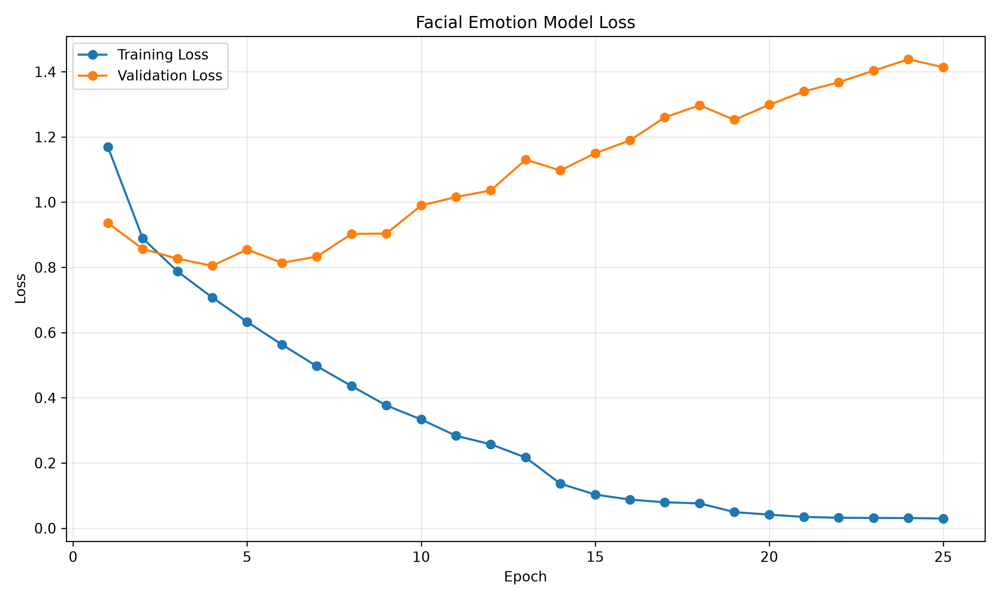
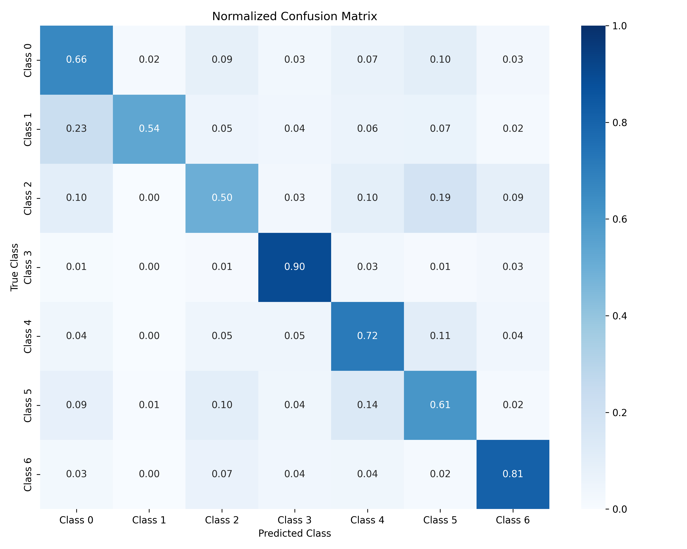

# Facial Emotion Detection System – Part 1

## Overview
This project is Part 1 of a Multimodal Emotion Detection System. It uses deep learning to detect facial emotions in real time through a webcam.

The system classifies seven emotions:
**Angry, Disgust, Fear, Happy, Neutral, Sad, and Surprise.**

## Datasets
The model was trained using cleaned facial expression data from:

- FER2013
- RAF-DB

The datasets are not included in this repository due to their large size.

## Model Performance
The model was trained using PyTorch with CUDA GPU acceleration and achieved approximately **68% evaluation accuracy**.

The repository includes the trained model, training history, confusion matrix, and classification report.

## Files
- `clean_datasets.py` – Dataset preprocessing
- `train_facial_model_cuda.py` – Model training using CUDA
- `part1_facial_emotion.py` – Real-time facial emotion detection
- `models/` – Trained model, emotion labels, and evaluation results


## Results

### Training Accuracy


### Training Loss


### Confusion Matrix



## How to Run

Install dependencies:

```bash
pip install -r requirements.txt
